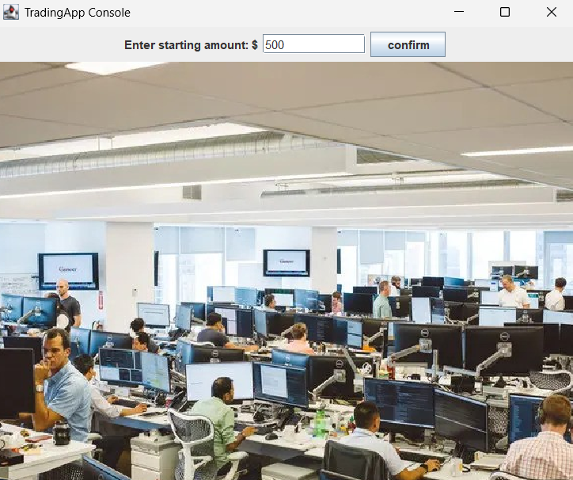
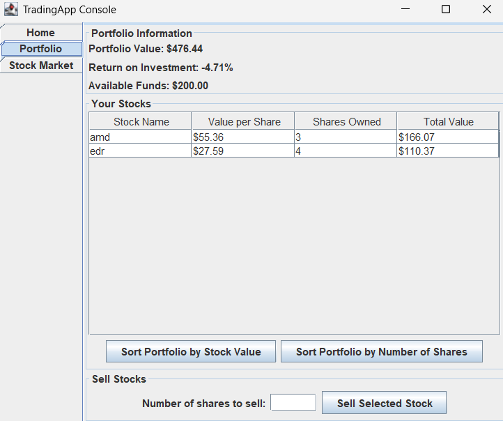
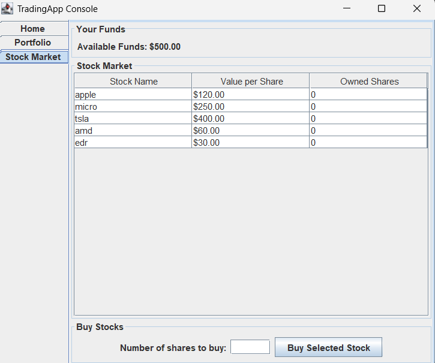
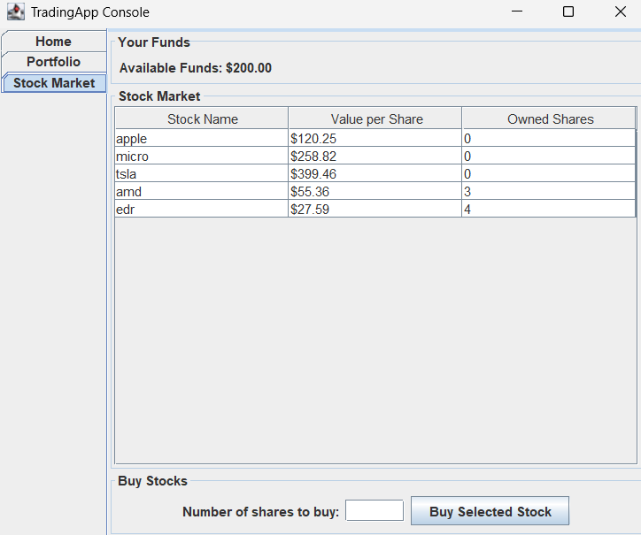
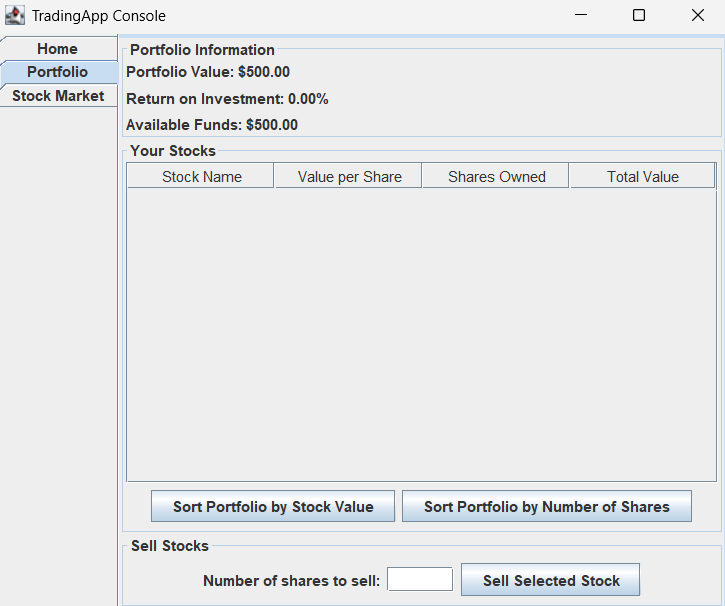
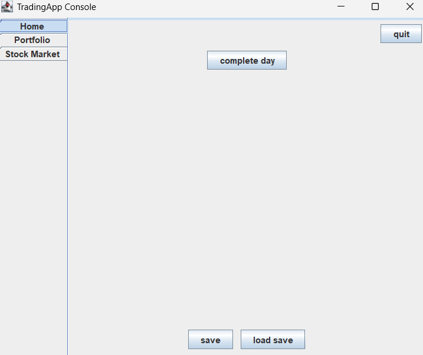

# Stock Trading Simulator

A Java Swing desktop application for simulating stock market trading with portfolio management and ROI tracking.



## Overview

Virtual stock trading platform with dynamic price simulation, portfolio analytics, and an basic GUI. Built to demonstrate OOP principles, data persistence, and Swing competency.

## Key Features

### Portfolio Management & Analytics


- ROI calculation
- Sortable stock tables (by shares or value)
- Total portfolio value visualization
- Buy/sell transactions

### Live Stock Market


- Dynamic price updates with configurable volatility (±2.5%, ±10%, ±20%)
- Fund tracking
- Stock selection interface

### Price Simulation After Trading


Market values update dynamically, showing basic price fluctuations based on stock volatility levels.

## Technical Stack

**Core Technologies:**
- Java SE (Swing GUI)
- JSON for data persistence
- Custom TableRowSorter with comparators

**Key Components:**
```
model/
├── Stock.java          # Stock entity with volatility simulation
└── Portfolio.java      # Portfolio management & ROI calculations

ui/
├── TradingAppUI.java   # Main controller & tab orchestration
├── PortfolioTab.java   # Portfolio view with sorting
└── MarketTab.java      # Market view with buying logic
```

## Technical Highlights

- **Custom Sorting**: Implemented TableRowSorter with custom comparators for currency-formatted values
- **State Synchronization**: Real-time tab updates using ChangeListener pattern
- **Input Validation**: Comprehensive error handling for all user transactions
- **Event-Driven Design**: ActionListener-based interaction model
- **Algorithm Design**: Random volatility simulation with configurable risk levels


## Feature Showcase

| Initial Setup | Empty Portfolio | Active Trading |
|--------------|-----------------|----------------|
|  |  |  |

### Home Screen Features


- Save/Load portfolio functionality
- "Complete Day" for market simulation
- Clean, minimal interface

## Skills Demonstrated

- Object-Oriented Programming & Design Patterns (MVC)
- Java Swing GUI Development
- Event-Driven Architecture
- Data Structures (ArrayList, custom comparators)
- Algorithm Implementation (ROI, volatility simulation)
- State Management across components
- Input validation & error handling

## Future Enhancements

- Historical price charting
- Advanced order types (limit, stop-loss)
- Portfolio diversification metrics

---
